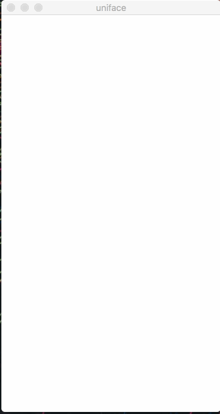

uniface
=======

An experiment in building a universal interface for my programs.

What is this?
-------------

I write a lot of single-purpose programs. In every program, I end up
reimplementing the same UI stuff over and over. Most of my programs are text
mode with modal interfaces. That is to say that at any time, only one UI
element is active. That might be for example a progress bar or a text input.
Everything else just scrolls up and off the top of my terminal. I like this
workflow, but it's not very pretty, and not very portable. Doesn't work well
on small screens, isn't fun to integrate with, and doesn't lend itself to
reuse.

So this is my solution to those problems. I've designed it specifically for me
and what I like.

Running the demo
----------------

In `servers/electron`, do `yarn && yarn start`. You can also do `npm install
&& npm start` if you hate yourself.

Now go into `clients/uniface-go/demo` and do `go build && ./demo`. If you
don't have your `GOPATH` set up correctly, or if you don't have this
repository cloned to the right place, this will probably fail.

Look, whatever. I know you're lazy. Just watch the gif and look at the example
client code to see what's happening. I'll update it when I add or change
stuff.

Non-goals
---------

This is not meant to become a replacement for any other non-modal UI
framework. I'm sure I'll bend the rules and add some non-modal stuff at some
point, but basically this is _never, ever_ going to even come close to
replacing something like interface builder. This is not a generic toolkit.
